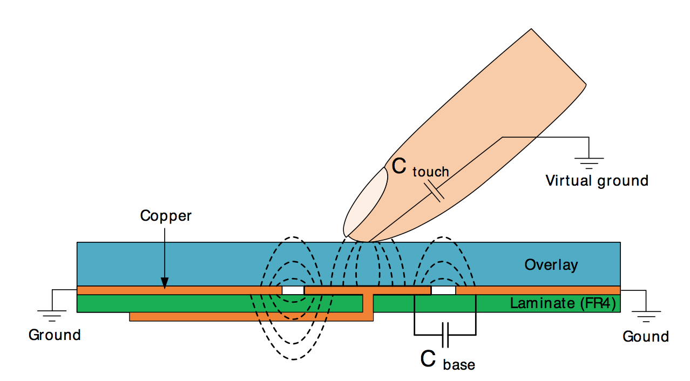
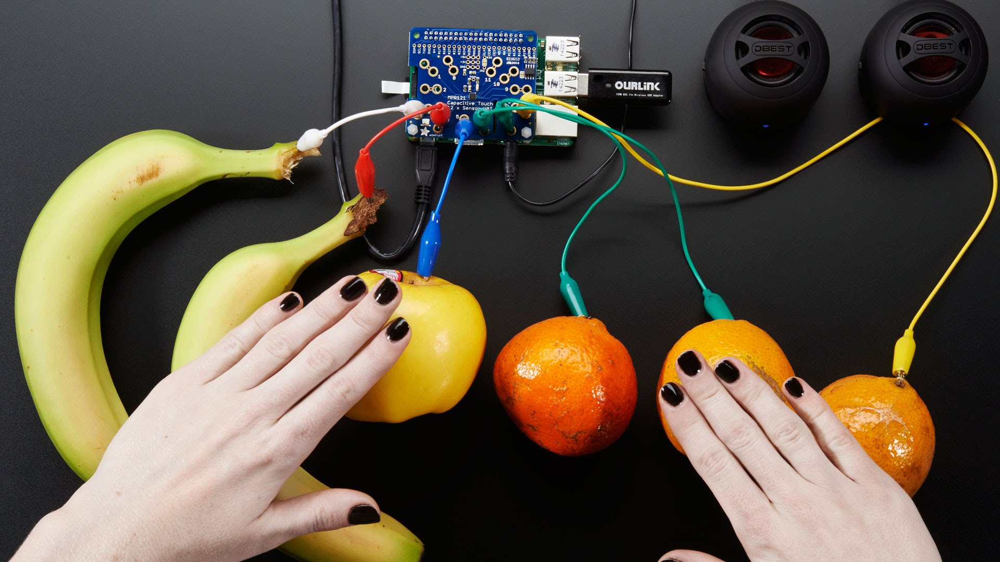
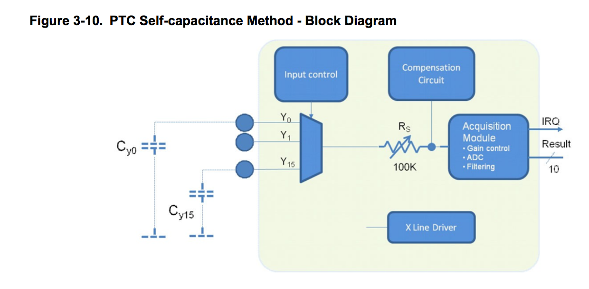
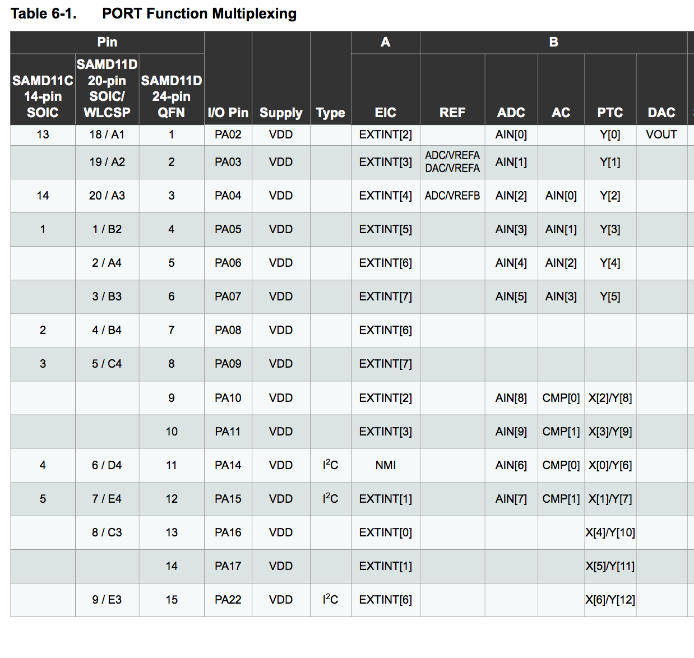
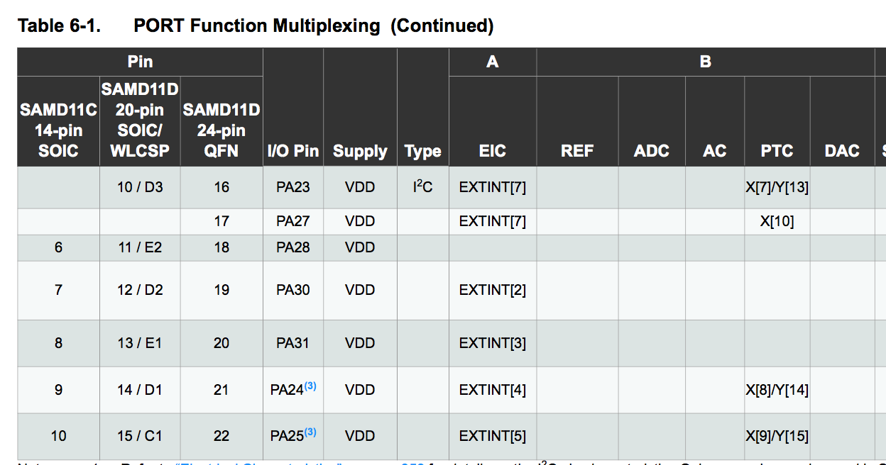

# Adafruit_FreeTouch

This is a QTouch-like library allowing use of the PTC (peripheral touch controller) on the ATSAMD11 and ATSAMD21. This means you can do capacitive sensing where your finger touching the pad is all takes to trigger a "button" press. 

This code is a FORK of the adafruit library with the following major changes:

- Improve internal documentation
- Use a more compatible way of adjusting pinmux
- Removal of reliance on the ASF framework (and the Adafruit_ASFCore library) which opens the door for drop-in compatibility with SAMD variants beyond the 21G
- Added support for the SAMD11 architecture which is a cheaper chip with more available Y sense lines than the SAMD21
- Renamed one of the "unknown" registers that inadvertently has something SAMD21 specific inside.

# Introduction
Ever wanted to add intuitive capacitive touch user interfaces to your hobby-grade Arduino project but frustrated by the lack of available libraries?  

 This library is an Arduino-IDE compatible code library that provides first-ever open-source access to Atmel's latest-generation "Peripheral Touch Controller" (PTC). The PTC is a hardware-based capacitive sensor that can detect proximity of your fingers to special "pads" or areas of your circuit board. This lets you implement things like buttons, wheels and sliders without any actual moveable hardware or external components. 

The basic idea, (taken from the AN0040 datasheet.)

Self-capacitive sensing is amazing - you actually don't need any external components at all -- not even a resistor! In fact, the folks at Adafruit have even used such a thing to turn fruit into a user interface. Here is a screen shot from [@ladyada's wonderful Youtube explanation of touch sensing.](https://www.youtube.com/watch?v=Wk76UPRAVxI)

Until now, the PTC has been closed source and is undocumented, meaning you have to use [Atmel's proprietary libraries](http://www.atmel.com/tools/QTOUCHLIBRARY.aspx), if you want to access the hardware on your Arduino-compatable processors. Furthermore, due to [licensing issues](https://code.google.com/archive/p/arduino/issues/199), the Arduino IDE has never officially supported Atmel's QTouch libraries. However, in 2017 there have been two parallel efforts to reverse engineer the PTC peripherals from the Atmel source. The first is from [LadyAda](https://www.youtube.com/watch?v=T1EgC_NO6qs). The second is [LibrePTC](https://github.com/jgilbert20/Libre_PTC). 

# Project status

This library is aimed to give PTC access for the casual hobbyist. The aim is to create a stable library that you can drop into your weekend project. Everything is released under a permissive MIT license.

If you are looking for robust, production-ready tools, please do not consider this library. Please use QTouch. You'll get tons of free support from Atmel and only they really know how they're hardware works. Got it? We'd rather not see fleets of self-driving cars or medical devices running around the world with capacitive buttons that usie a handful of poorly understood, undocumented registers. 'nuff said.

# Key resources

[ATSAMD11 Data Sheet](http://ww1.microchip.com/downloads/en/DeviceDoc/Atmel-42363-SAM-D11_Datasheet.pdf) - You'll find a brief overview of the PTC here but its quite short on details. The data sheet is useful because it establishes the common patterns of peripheral busses, control registers and clocks that the PTC hardware uses.

[ATSAMD21 Data sheet](http://ww1.microchip.com/downloads/en/DeviceDoc/40001882A.pdf) - Ditto the above

[Atmel QTouch Library User Guide](http://www.atmel.com/images/doc8207.pdf) (8207L-AT42-05/12) - Older document describing QTouch for the AVRs but useful to understand the terminology

[QTouch atmel-42195-qtouch-library-peripheral-touch-controller_user-guide](http://ww1.microchip.com/downloads/en/DeviceDoc/atmel-42195-qtouch-library-peripheral-touch-controller_user-guide.pdf) - The full user guide to the latest QTouch controller

# Basic pin mapping

On the SAMD21, there are a total of 9 pins that are able to be used for self-capacitive sensing (which is the sort of sensing this library supports.) Those pins are PA2, PA3, PA8, PA4, PA05, PA06, PA07, PB02, PB03.

On the SAMD11 there are fourteen pins that are supported: A2, A3, A4, A5, A6, A7, A8, A10, A11, A14, A15, A10, A11, A16. However, note that if you also want to use I2C you will be limited to only 12 of these 14 pins.

# Library details

What follows is a bit of a brain-dump on what I know about the PTC and capacitive sensing in general to serve as a guide for future users.

Capacitive touch sensing relies on the idea that your fingers affect electrical fields around them because they are partial conductors. "Capacitive" is fancy engineering term for the idea of being able to "hold" a charge, meaning that if you put a small amount of energy into something it will be held and can later be released. Any pad, wire or conductor has some level of capacitance, including the wires in your project. When you make a capacitive sensor pad as a bit of copper, you're effectively making a capacitor.

When your finger approaches and gets near a capacitive sensing pad, it effectively alters the capacitance of the sensor pad because the "capacitor" is now a combination of the existing pad plus whatever your finger has.

Just to be super clear, when we talk about "capacitor", we aren't talking about a ceramic or electrolyic component you've added into your project as an external component. We are talking about the virtual capacitor formed by any electrical conductor.

How do you measure capacitance? I have no analog electronics training, but my basic understanding is that you charge the capacitor to a known voltage and then connect it to a resistor to ground. The resistor drains the capacitor, and the rate of the discharge is proportional to the capacitance.

The basic idea of any capacitive sensor is that there is a baseline level of capacitance in your sensor pad when there is no finger or object. This reference level can change based on your circuit design, power supply, case design, mounting, pad layout, etc. 

When a finger approaches and then touches the pad, the capacitance increases. This difference in capacitance is called "delta". Delta is the signal you actually care about when you want to read out a sensor.

In the case of touch measurement, the "capacitor" is charged by repeatedly raising the voltage of the sensor line of one of the GPIO pins. Then the voltage source is taken away, and the GPIO line is connected to a resistor and a analog to digital converter which measures the voltage as it declines. This design arrangement is called "self-capacitive" in Atmel's terminology. 

If you look at the design of the PTC from page 18 of the 42195 design guide, you see this basic structure.

In this chart, presumably the "input control" is the switch that either charges the capacitive sensing pad or routes the charge to the discharge resistor. Atmel doesn't show it explicitly but I think you can adjust the discharge resistor R(s) value, affecting the measurement. Atmel also has a compensation circuit that is basically a black box but seems to involve additional capacitors. There are hardware registers that I believe are involved in this compensation circuit.

The most important thing to know as a user is the connection between the peripheral inputs and the physical ports on your chip. In Atmel's terminology there are X lines and Y lines. The Y lines are the ones that actually measure capacitance and are connected to the resistor. The X lines are further "drivers" that can be used in the case of matrix measurement which is a more advanced step.  

Not every pin on your MCU can be a "Y" line. That means not every pin can be connected to a capacitive sensor pad and measure touches. Through the magic of "port muxing", Atmel gives you a way to connect different pins to different peripherals and   its not a 100% crossbar.

On page 13 and 14 of the SAMD11 data sheet, (page 21,22 of the SAMD21), you get a chart giving you a link between the phyisical pin on your chip, the "name" of the pin (e.g. "PB04"), and the peripherals that can be attached to it.

Look in the PTC column on the far right and you can see if the GPIO pin can handle either being a X line or a Y line or maybe even both.

This chart is vital for setting up a project using either QTouch or this library. To read a sensor, you must provide the library a "Y" channel to read. Be careful! Some pins may already  be in use for things like your clock or I2C. For instance, PA22 and PA23 on the D11 chips can be used as PTC lines Y12 and Y13. But those two pins are assigned by the ArduinoCore to SDA and SCL already and in fact are only one of the two possible pairs of pins that can be mapped to the I2C hardware.

Another gotcha: Some Y lines don't map to physical pins on all variants. For instance Y10-Y13 on the SAMD21 architecture is not broken out on the "G" version of the chip, which is the most commonly-used variant (driving nearly all of the Arduino-Compatible SAMD cores.) This quirk is why the D11 architecture actually has more capacitive sensing lines than its big brother D21-G.

Just remember the API to is expecting you to provide it the Y line you want to measure and read the data sheet carefully.

